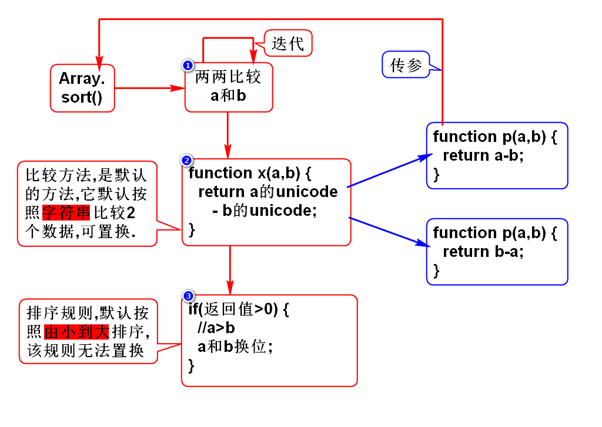
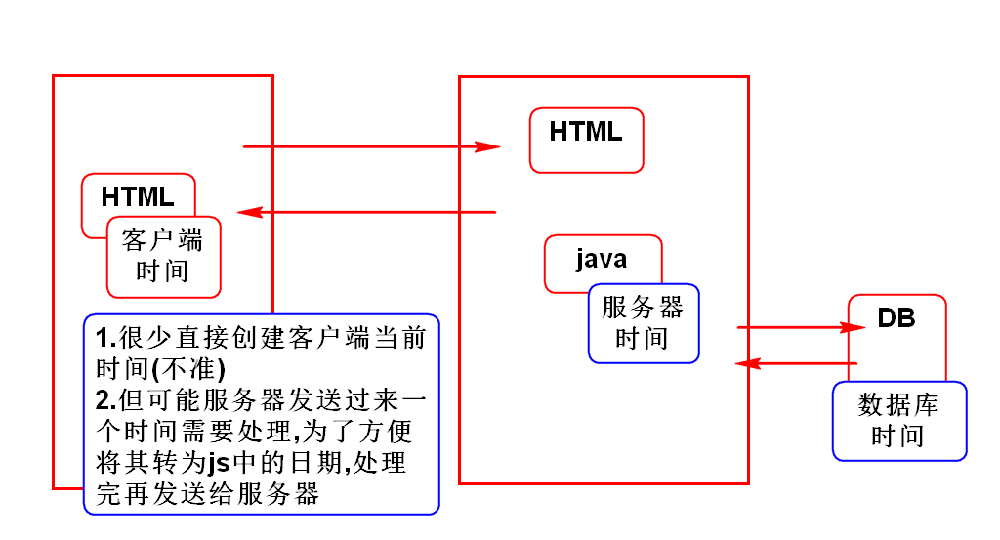
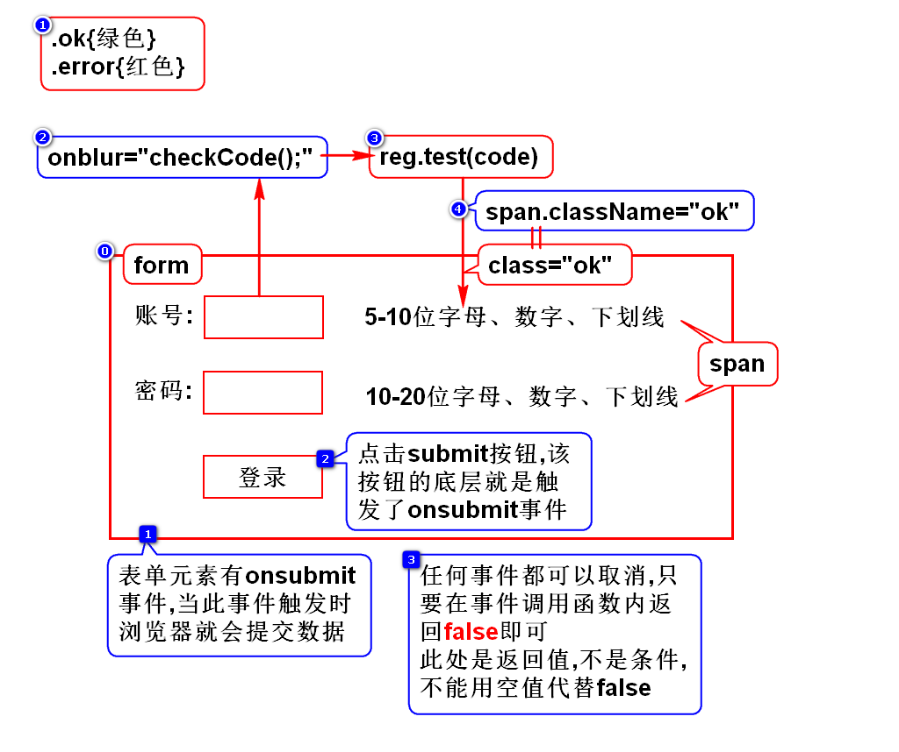
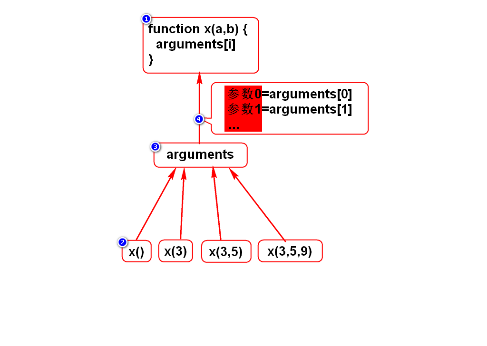

# 一.String对象(看看)
- 几乎和Java中的String一样

# 二.Number对象(*)
- toFixed(n)

# 三.Array对象(*)
- 如何创建数组
- 数组倒转的方法
- 数组排序的方法(*)

# 四.Math对象(看看)
- 几乎和Java中的Math一样

# 五.Date对象(看看)
- 如何创建日期对象

# 六.RegExp对象(*)
## 1.正则对象的方法
- test() ***
- exec()

## 2.字符串支持正则的方法
- replace() *
- match()
- search()

## 3.登录案例

# 七.Function对象(*)
## 1.arguemnts(*)

