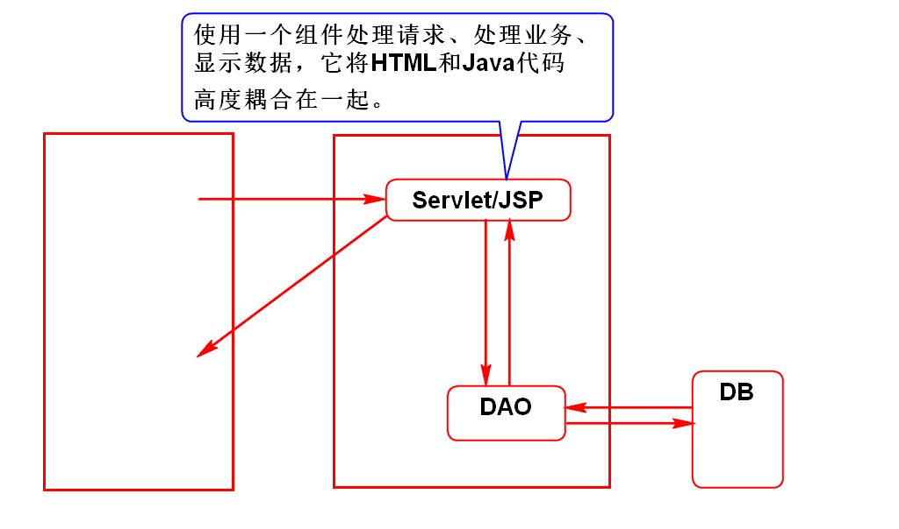
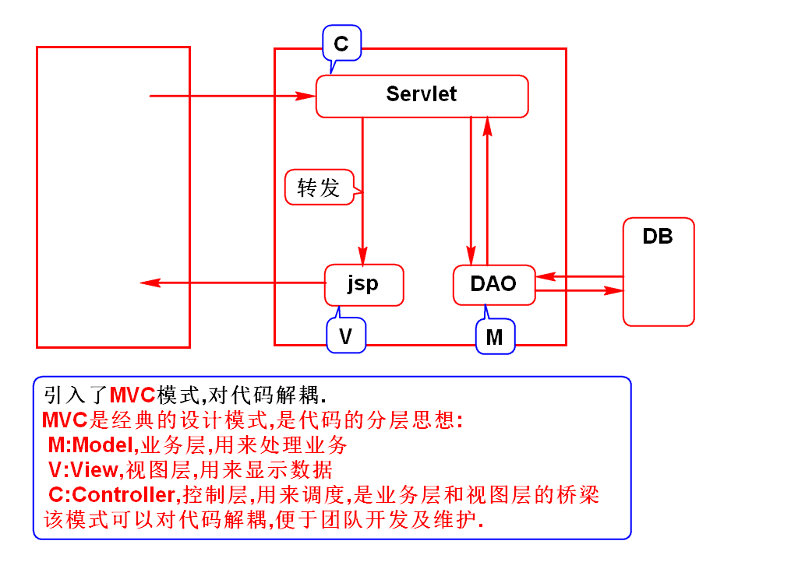
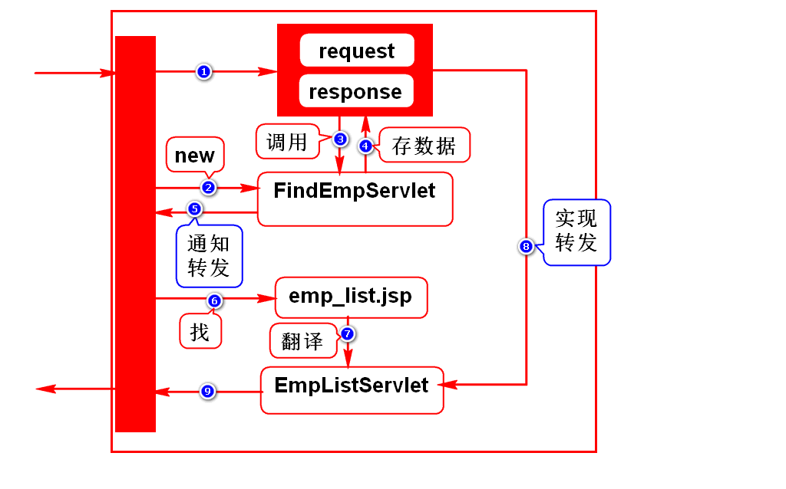
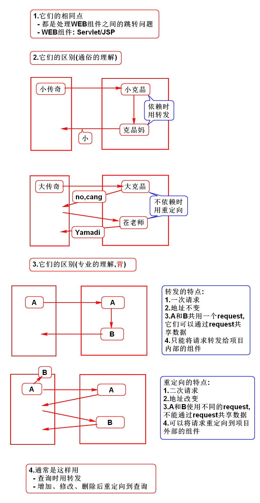
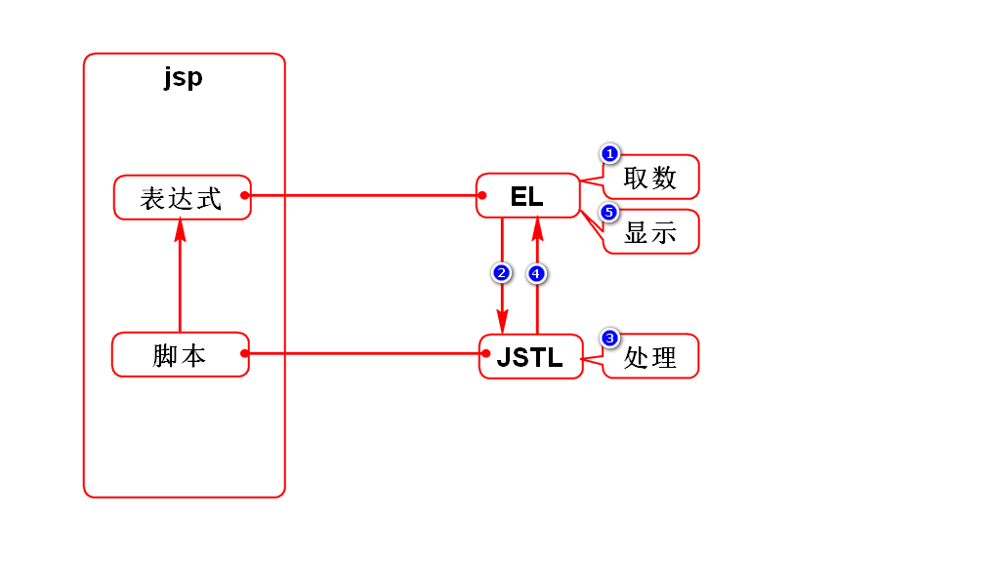
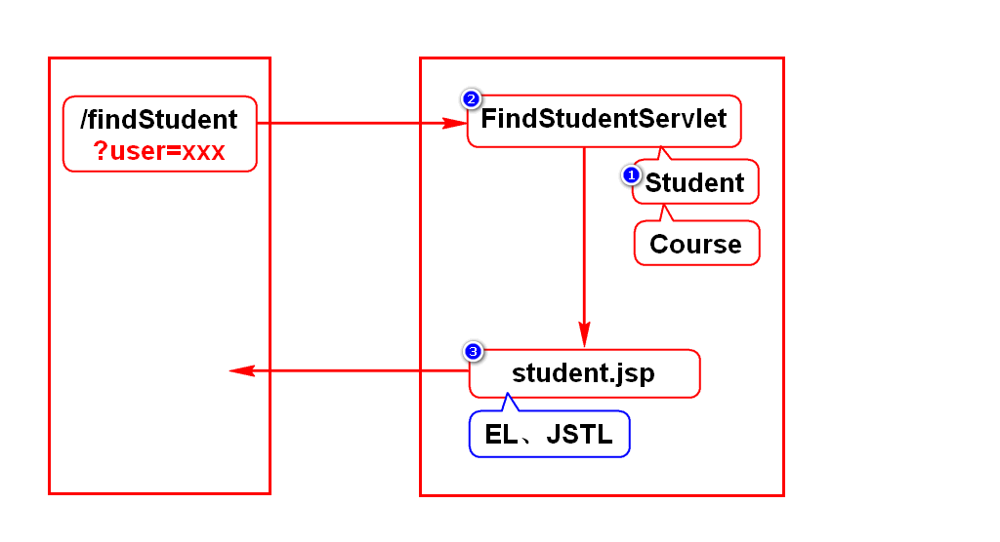
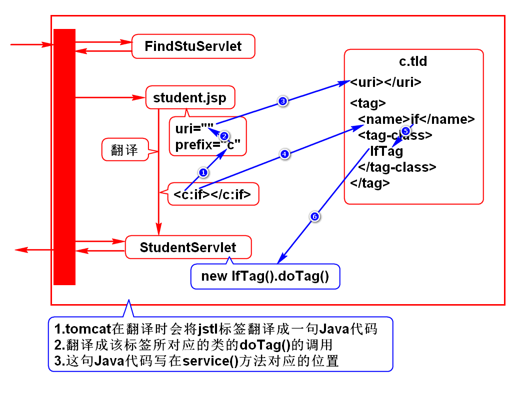

# 一.开发模式
## 1. Model 1

## 2. Model 2(MVC面试题,极重要)

# 二.转发的执行过程(理解)

# 三.转发和重定向

# 四.EL和JSTL
## 1.作用

## 2.案例

## 3.JSTL原理

# 补充
## 1.导包失败怎么办?
1. 在pom.xml中选择jar包,点击remove
2. 删除.m2/repository下这个包所在的目录
> Eclipse左侧展开Libraries可以看到存储目录