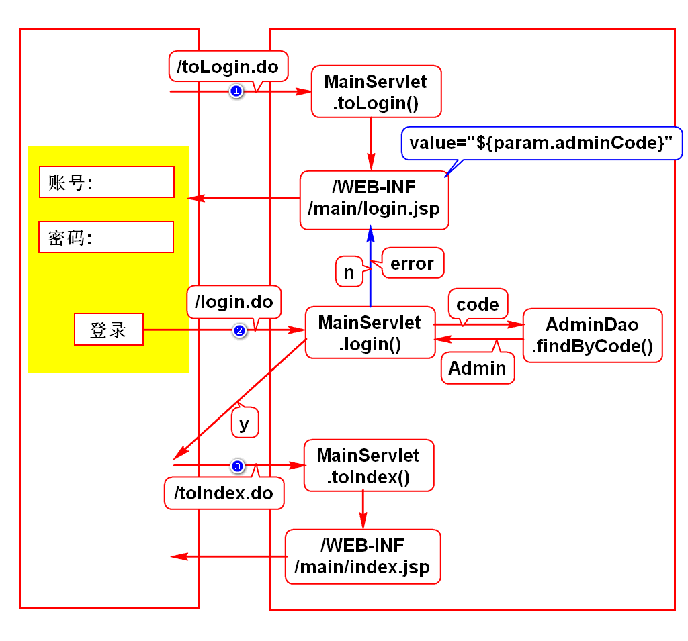
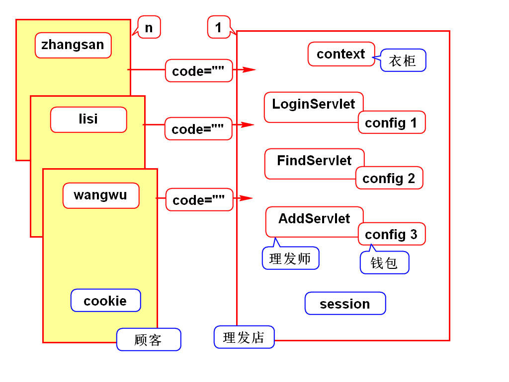
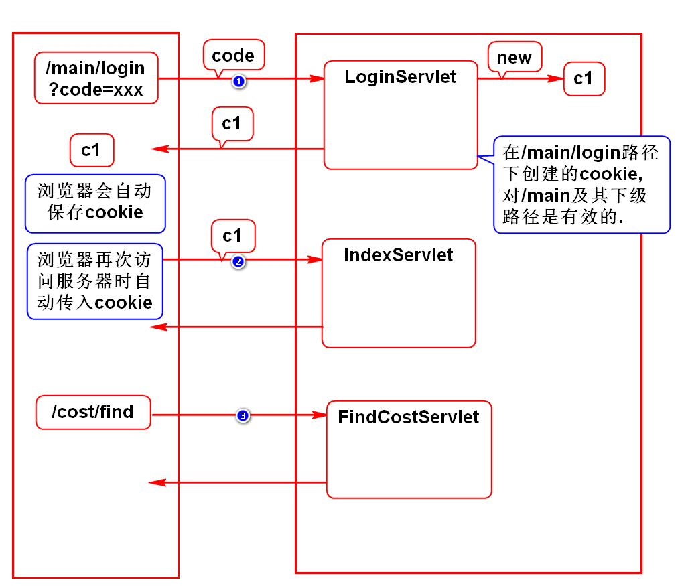
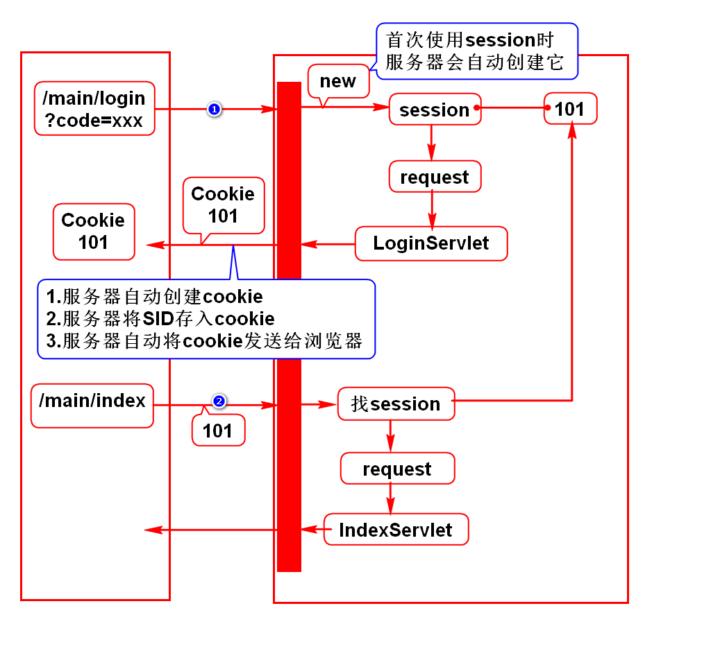

# 一.登录

# 二.cookie和session
## 1.业务场景
- 登录时要记录账号
- 后面的增删改查等功能要显示此账号

## 2.错误的方式
### request
- 登录、查询是2个请求，它们使用不同的request
- 登录时将账号存入request1,查询时从request2取值

### config
- 可能项目中使用多个Servlet处理多个请求
- 可能使用LoginServlet处理登录请求
- 可能使用FindServlet处理查询请求
- 2个Servlet使用2个不同的config,数据无法共用

### context
- 一个项目内只有唯一的一个context
- 浏览器和服务器是多对一的关系
- 不同的人登录，传入的数据名字一样，值不同
- 将同名的数据存入context,互相冲突

## 3.正确的方式(*)
- 使用cookie和session存储这样的数据
- 内部的数据可以在多个请求之间共用
- 内部的数据可以再多个Servlet之间共用
- 该对象内是每个浏览器单独存一份数据

## 4.它们的区别(*)
- session数据存储在服务器上,服务器压力大,但安全
- cookie数据存储在浏览器上,服务器压力小,但不安全

## 5.使用场景
- 重要数据存到session上
- 普通数据存到cookie上

# 三.cookie
## 1.案例

## 2.要点
- 如何创建、发送、获取cookie
- 如何修改cookie的生存时间
- 如何向cookie存中文
- 如何修改cookie的生效路径

# 四.session
## 1.案例

