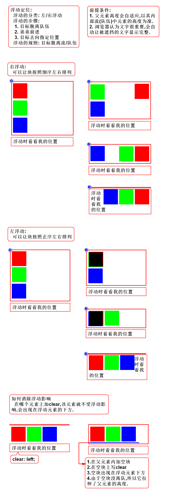
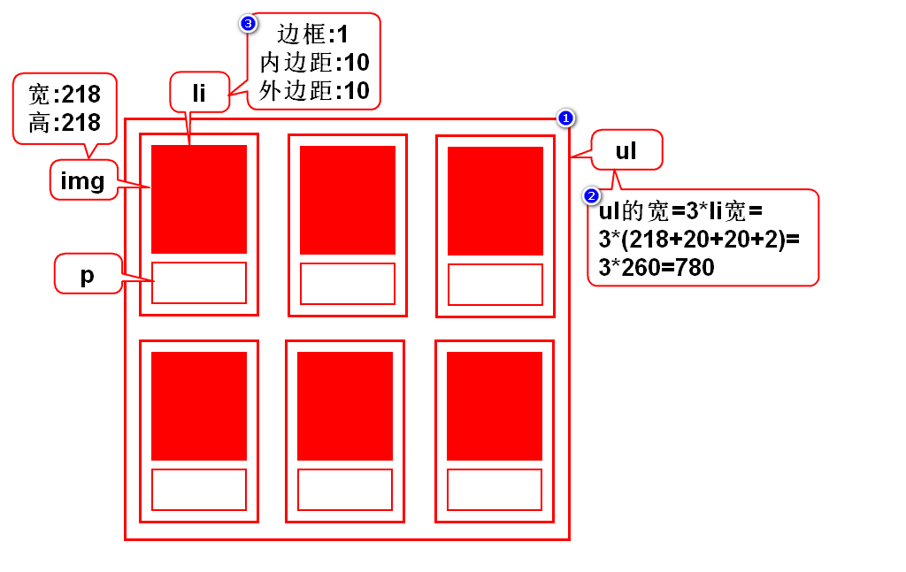
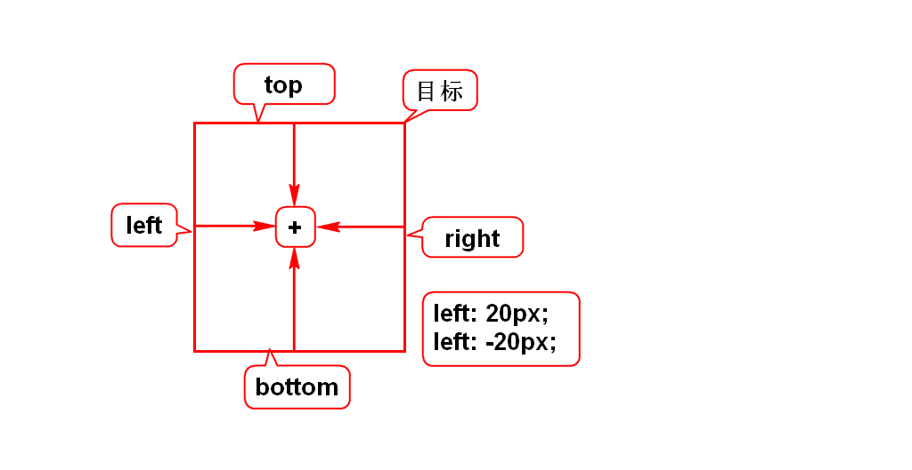
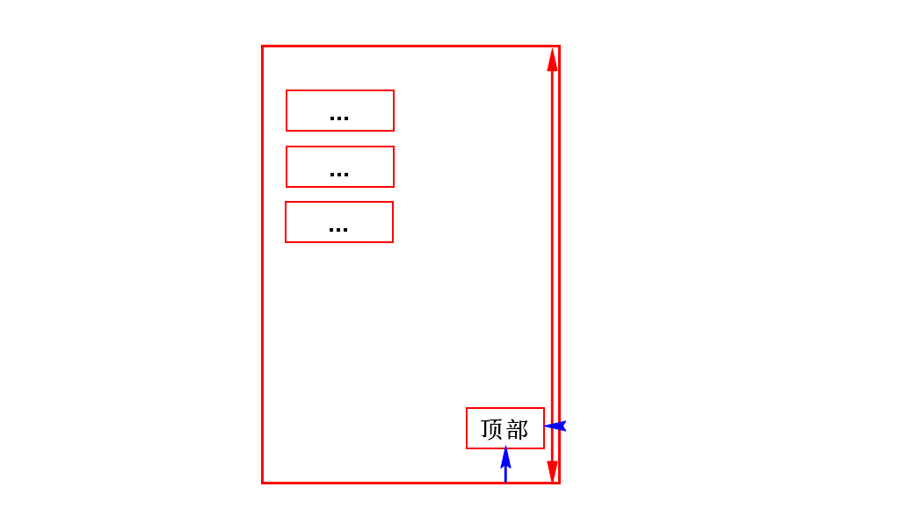
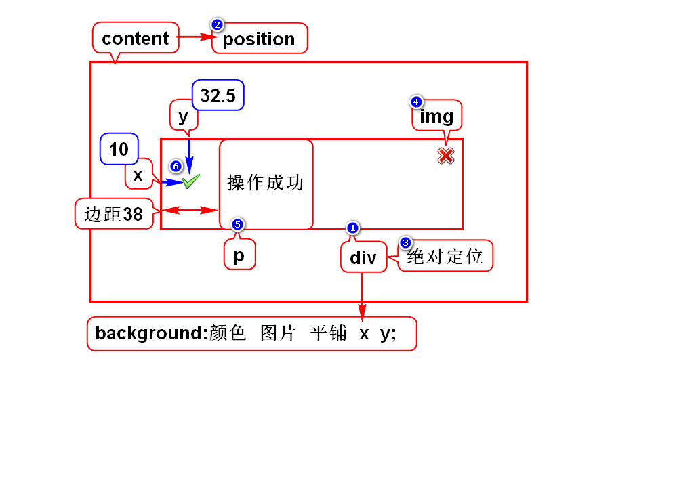

# 一.定位简介
## 1.定位的作用
- 用来解决元素的排列(摆放)问题
- 采用定位可以将元素摆放到任意位置

## 2.定位的分类(5)
### 2.1默认定位(1)
- 块元素垂直排列,行内元素左右排列
- 元素默认的排列方式称之为流定位
> 流:理解为元素有序排列形成的队伍

### 2.2特殊定位(4)
- 浮动定位:可以让块左右排列
- 相对定位:以自己为目标产生微小的偏移
- 绝对定位:以父亲为目标产生较大的偏移
- 固定定位:以窗口为目标产生巨大的偏移

# 二.浮动定位
## 1.规律

## 2.照片墙案例

# 三.相对、绝对、固定定位
## 1.它们的共同点
- 设置偏移的方式相同
- 以任意边为基准,向中心方向偏移为正,反之为负

## 2.相对定位
- 以自己为目标
- 元素不脱离流(队伍)
- position: relative;
> 只有相对定位不脱离流

## 3.绝对定位
- 以带有position属性的父辈元素为目标
- 若父辈都有position则采用就近原则
- 若父辈都没有position则以body为目标
- 元素会脱离流
- position: absolute;
> 我们想以谁为目标,就在谁上面加position

## 4.固定定位
- 以浏览器的窗口为目标产生偏移
- 元素脱离流
- position: fixed;
> 元素永远挂在窗口上,不会随着滚动条而滚动

# 四.如何选择定位
1. 固定定位:看元素是否要挂在窗口上保持不动
2. 浮动定位:看块元素是否要横向排列
3. 相对定位:看元素是否要释放位置,偏移量是否很小
4. 绝对定位:15秒内没想出来一般就是绝对定位

# 五.管理员列表-5

# 六.元素的显示方式
## 1.块
- 有宽高,垂直排列
- h/p/ol/ul/div/table/form

## 2.行内
- 无宽高,水平排列
- span/b/strong/i/em/u/del/br/a/label

## 3.行内块
- 有宽高,水平排列
- img/input/select/textarea

## 4.如何修改显示方式
- 通过display属性加以修改
- block:块
- inline:行内
- inline-block:行内块
- none: 隐藏此元素

