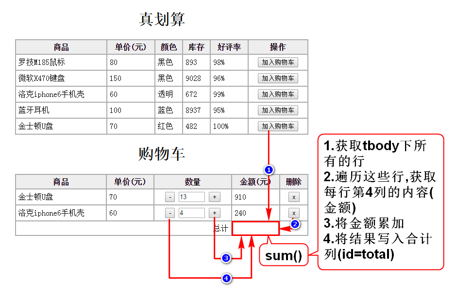
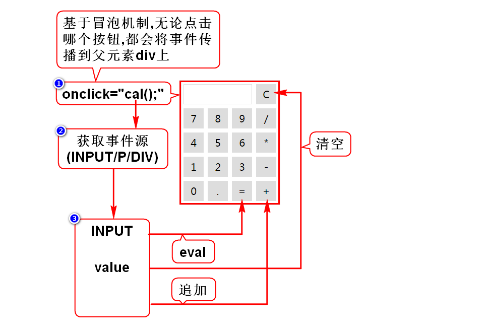

# 一.计算合计

# 二.自定义对象
## 1.直接量(JSON对象)
- {"name":"zs","age":25,"work":function(){}}
- {}代表一个对象,包含多组键值对
- key通常是字符串,value可以是任意类型的数据

## 2.构造器(用来new的函数/首字母大写)
## 2.1内置构造器
- 特殊:Array,Date,RegExp,Function
- 通用:Object

## 2.2自定义构造器
- 自定义一个函数,函数名首字母大写
- 声明参数,让调用者直观的了解对象的结构

## 3.归纳
- 3种方式创建的对象都一样,都是Object
- 若创建的对象给别人使用,建议用2.2
- 若创建的对象给自己使用,用1或2.1都行

# 三.事件
## 1.事件概述
### 1.1什么是事件
- 就是用户的操作,就是js被调用的时机

### 1.2事件的分类
- 鼠标事件
- 键盘事件
- 状态事件:当某条件达成时自动触发

## 2.事件定义
### 2.1直接定义事件
- 在元素上通过事件属性(onclick)定义事件
- 优点:直观
- 缺点:HTML和JS耦合度高

### 2.2后绑定事件
- 在页面加载后,通过JS获取元素并给它绑定事件
- 优点:耦合度低
- 缺点:不直观

### 2.3如何取消事件
- 在事件内返回false即取消

## 3.事件对象(event)
### 3.1什么是事件对象
- 某些特殊的业务里可能需要使用如下内容:
- 鼠标点击的坐标、具体点击了哪个按键等等
- 事件触发的时候,浏览器会创建一个对象,记录这些内容
- 调用这个对象就可以获取这些特殊的内容
- 这个对象叫做事件对象event

### 3.2如何获取事件对象
#### 直接定义事件
- 在调用函数时传入event
- 在函数上通过参数接收该值

#### 后绑定事件
- 浏览器在调用函数时自动传入event
- 在函数上通过参数接收该值

## 4.事件处理机制
### 4.1冒泡机制
- 如果内外元素都定义了单击事件
- 点击内层元素,外层的单击事件也会触发
- 触发的顺序是:由内向外
- 这种处理机制称其为冒泡机制

### 4.2作用
- 简化事件的定义
- 本来众多子元素都要定义单击事件
- 现在只需在父元素上定义一次事件即可
- 此时必须要知道事件源是谁
> 事件源:点击的具体位置,事件的来源

### 4.3如何停止冒泡
- 调用event的API可以停止

### 4.4如何获取事件源
- 调用event的API可以获取

# 四.计算器案例
