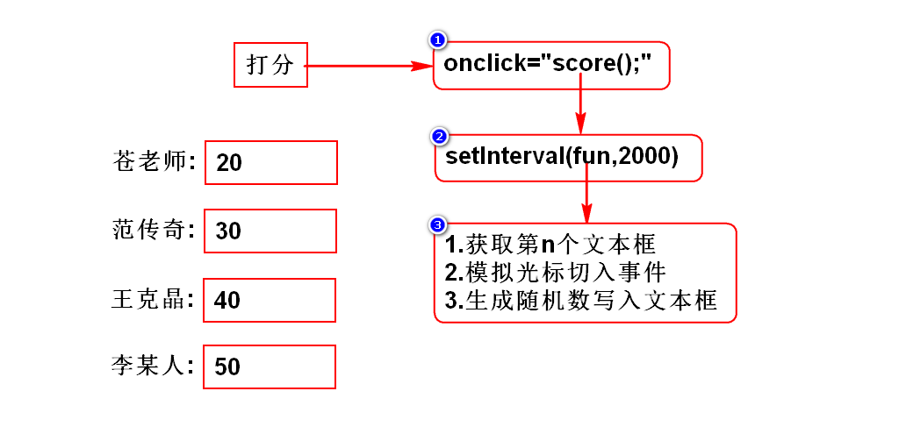

# 一.开发项目时所遇到的对象
## 1.$()
- 通过$()所获得的对象为jQuery对象

## 2.赋值(修改)
- 赋值方法通常返回的是jQuery对象

## 3.取值(读取)
- 返回的是文字,那么就是DOM对象(String)
- 返回的是元素,那么就是jQuery对象

## 测试
- 以控制台输出内容为准

# 二.jQuery事件
## 1.事件概述
- 和js一样

## 2.事件定义
### 2.1直接定义
- 和js一样

### 2.2后绑定(*)
- $(function(){})
- $().click(function(){})

### 2.3取消事件
- 和js一样

## 3.事件对象
### 3.1什么是事件对象
- 和js一样

### 3.2如何获取事件对象
#### 直接定义事件时
- 和js一样

#### 后绑定事件时(*)
- 和js一样
> 获取到的事件对象是经过jQuery封装的对象

## 4.事件处理机制
### 4.1冒泡机制
- 和js一样

### 4.2作用
- 和js一样

### 4.3如何取消冒泡(*)
- e.stopPropagation()

### 4.4如何获取事件源(*)
- e.target

## 5.合成事件(了解)
- hover
- toggle

## 6.模拟操作(*)
- trigger(事件)

