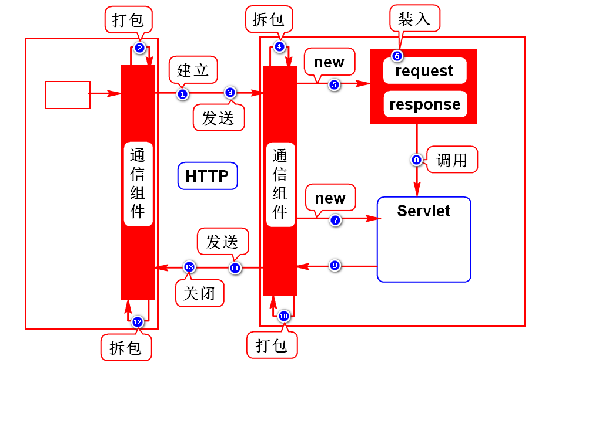

# 一.HTTP协议
## 1.什么是HTTP协议
- 超文本传输协议
- 就是W3C指定的规范
- 规定了浏览器和服务器怎么通信以及通信的数据格式

## 2.如何通信
1. 建立连接
2. 发送请求
3. 返回响应
4. 断开连接
> 特点:一次请求一次连接,降低服务器的压力

## 3.数据格式
### 3.1请求数据
- 请求行:请求的基础信息
- 消息头:业务数据的描述
- 实体内容:具体的业务数据

### 3.2响应数据
- 状态行:响应数据的基础信息
- 消息头:业务数据的描述
- 实体内容:具体的业务数据

## 4.对开发者的要求
### 4.1不需要我们做的事情
- 浏览器和服务器通信的过程已经由他们实现了
- 请求数据的打包(3部分)由浏览器实现了
- 响应数据的打包(3部分)由服务器实现了

### 4.2需要我们做的事情
- 请求及响应的业务数据由开发者提供
- 使用requst处理请求数据,使用response处理响应数据
> 学会使用request和response

# 二.注册案例

# 三.Servlet原理

# 四.请求方式
## 1.什么是请求方式
- 就是浏览器向服务器发送数据的方式
- 只需要掌握众多方式中的2种:GET和POST

## 2.GET
- 通过路径传参
- 参数在传递过程中可见,隐私性差
- 可以传少量数据
> 所有的请求默认都是GET请求

## 3.POST
- 采用实体内容传参
- 参数在传递过程中不可见,隐私性好
- 传递的数据大小不受限制
> 当form上增加了method="post"

## 4.如何选择
- 查询时用get,一般查询条件较少
- 保存、提交时用post，此时数据较多

## 5.可以通过浏览器观察请求方式
- 快捷键F12
- 打开NetWork

# 五.乱码解决方案

# 六.查询员工案例

# 补充
## 1.服务器常见问题
### 问题描述
- port 8080 are already in use

### 原因
- tomcat的端口被占用

### 解决方案1
- 重复启动tomcat导致其端口被占用
- 打开/tomcat/bin,手敲命令强制关闭它

### 解决方案2
- 其他软件占用了8080端口(如Oracle)
- 修改tomcat端口
- 打开Servers项目下server.xml,将65行8080修改
> 建议改为8088,8089