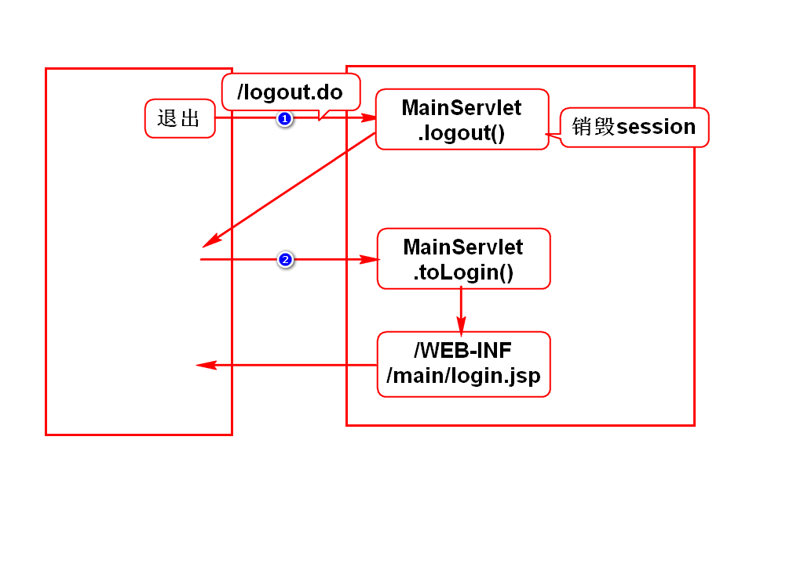
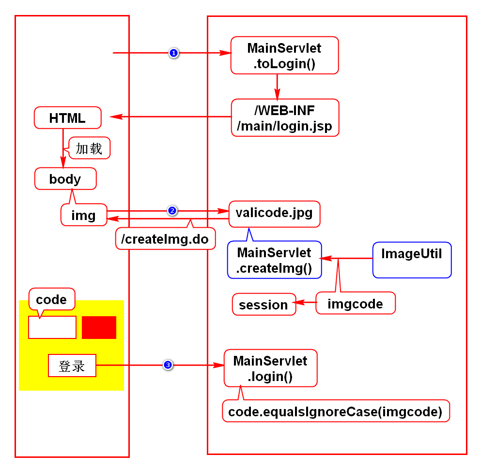
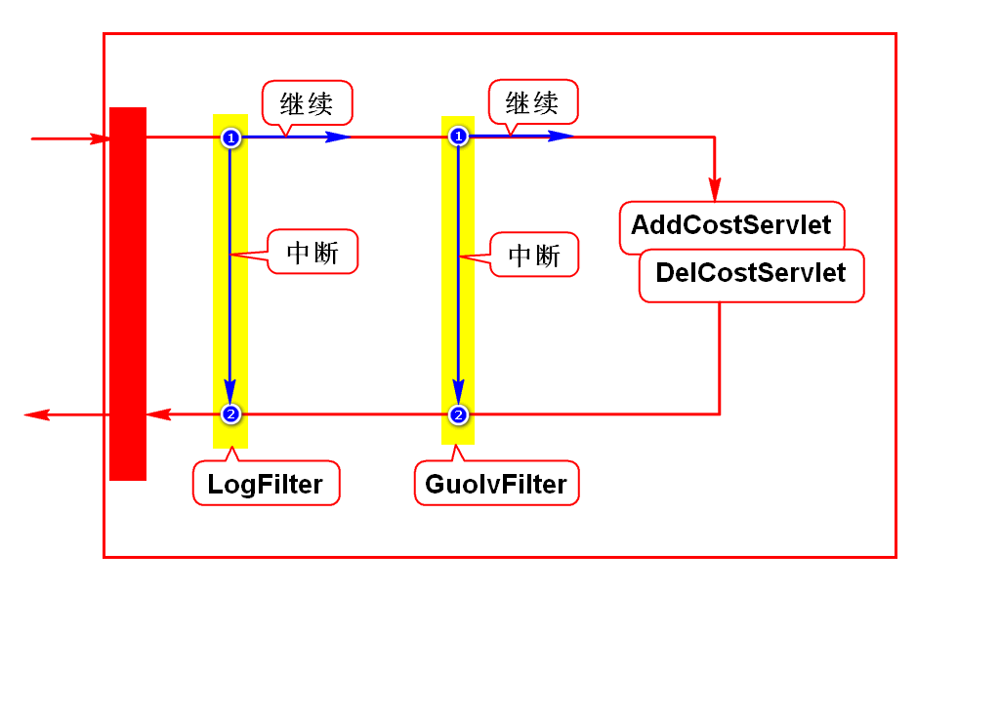
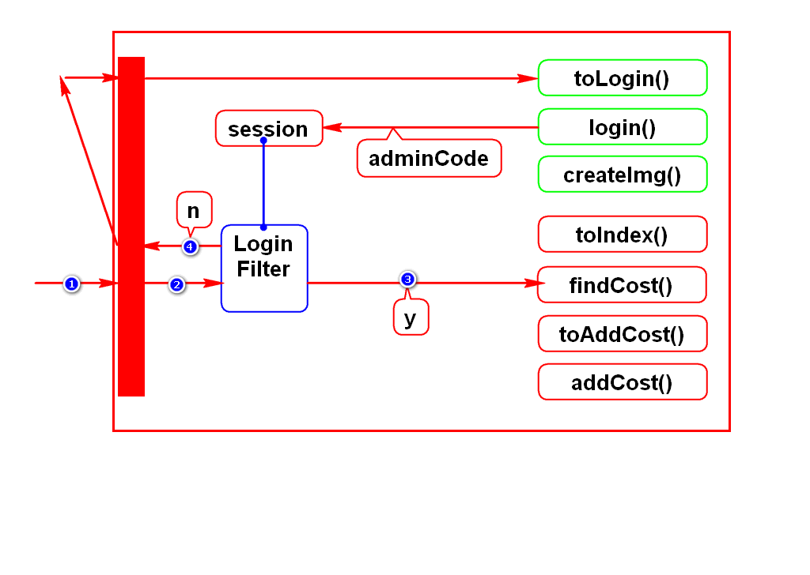
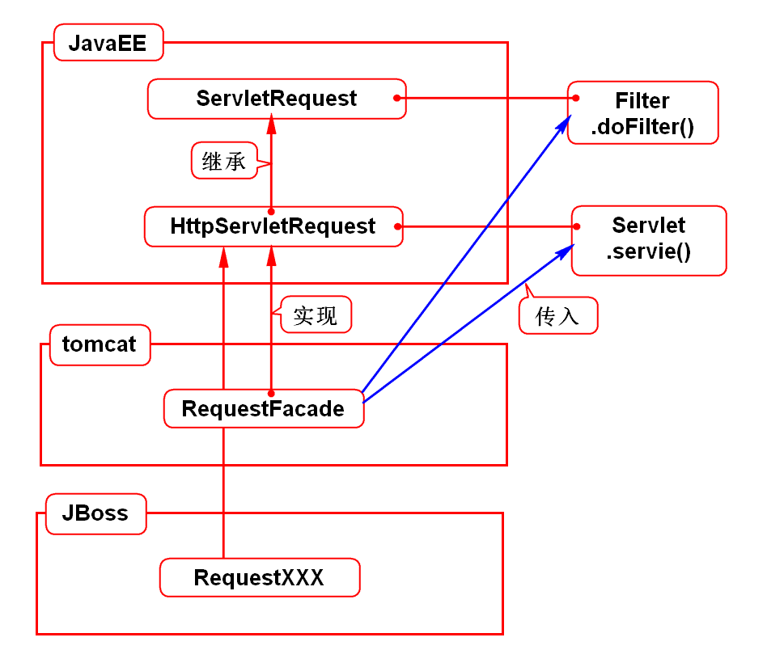

# 一.session学习要点
1. 如何创建session,如何存取数据
2. 如何销毁session
3. 如何修改session的生存时间
4. 禁用cookie时如何使用session

# 二.退出

# 三.验证码

# 四.cookie和session的作用(术语)
- HTTP协议是无状态协议(服务器默认没有记住浏览器)
- cookie和session是用来管理状态的(让服务器记住浏览器)
> 状态:服务器记住浏览器的证明(数据)

# 五.过滤器
## 1.它的作用
- 过滤器可以处理项目中的共性的需求
- 举例:记录日志、登录检查、过滤敏感词
> 很多请求都有的业务

## 2.使用步骤
1. 创建过滤器类,实现Filter接口
2. 在web.xml里配置此过滤器

# 六.登录检查

# 七.request

