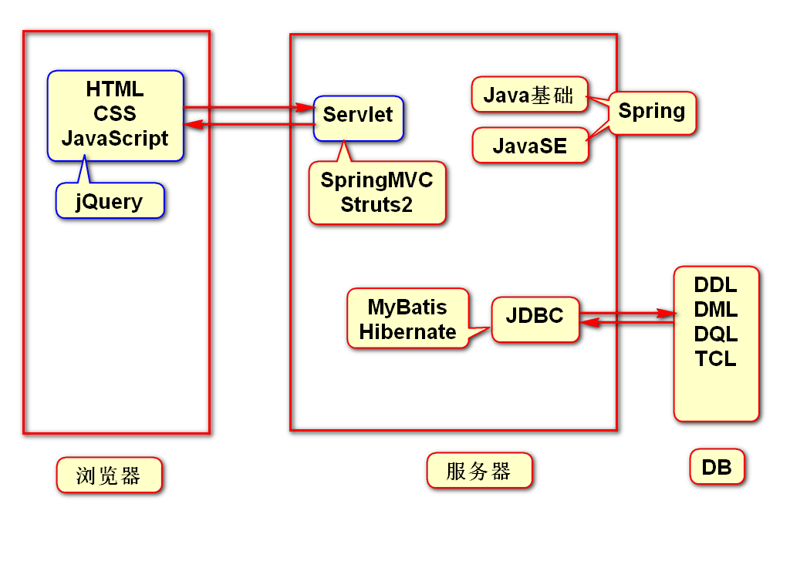
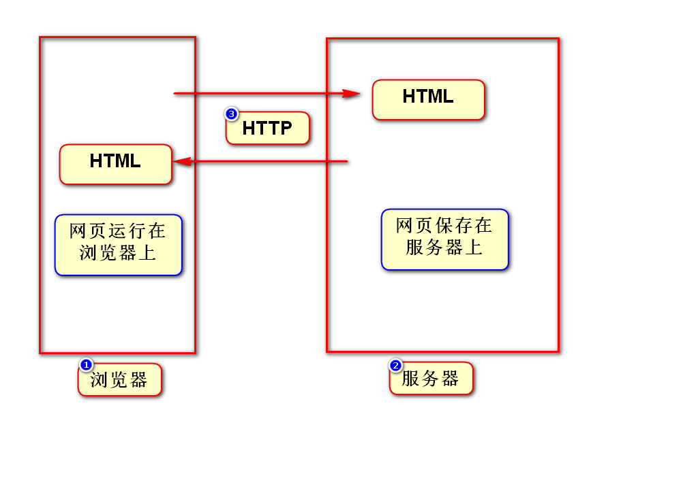
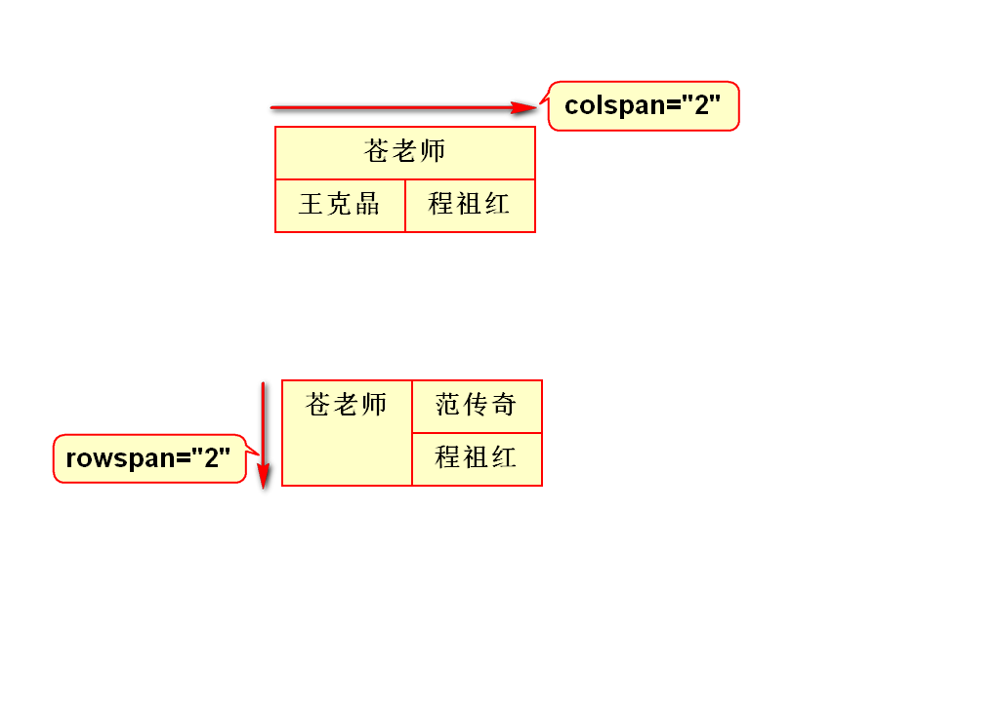
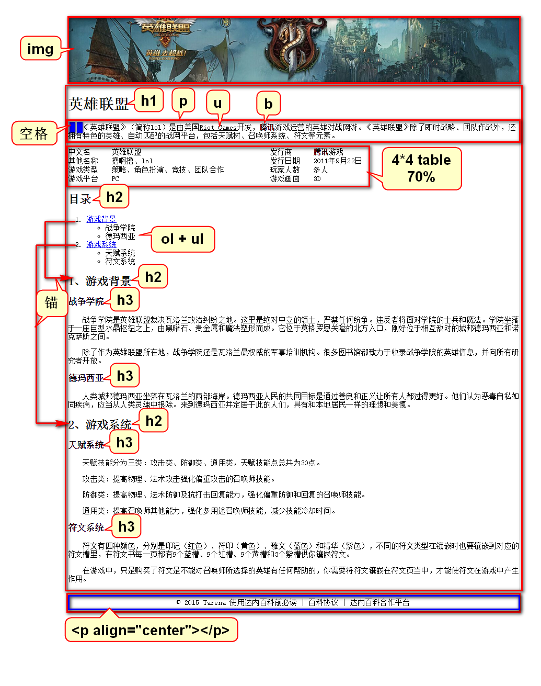

# 自我介绍
- 李洪鹤/lihh@tedu.cn

# 一.Java知识体系结构

# 二.课程介绍
## 1.HTML(1.5)
- 勾勒出网页的结构和内容

## 2.CSS(3)
- 美化网页

## 3.JS(4)
- 让网页呈现动态的数据和效果

## 4.jQuery(1.5)
- 框架，提高JS的开发效率

# 三.HTML
## 1.原理

## 2.XML和HTML的联系
### 1)XML
- 可扩展标记语言
- 标签、属性、嵌套关系可以自定义
- 存储或传输数据
> 扩展：自定义

### 2)HTML
- 超文本标记语言
- 标签、属性、嵌套关系都是固定的(w3c)
- 用于显示数据
- 有些版本的HTML严格遵守XML规范
> 可以将HTML理解为语法固定的XML

# 四.跨行和跨列

# 五.英雄联盟-百度百科
## 1.分区
- 在每个div上加这句话:
- style="border:1px solid red;width:960px;margin:0 auto;"

## 2.每个区域分别写标签

# 补充
## 1.如何创建WEB项目
- 选择JavaEE视图(点Eclipse右上角图标)
- 选择war
- 选择Deployment，右键点Generate