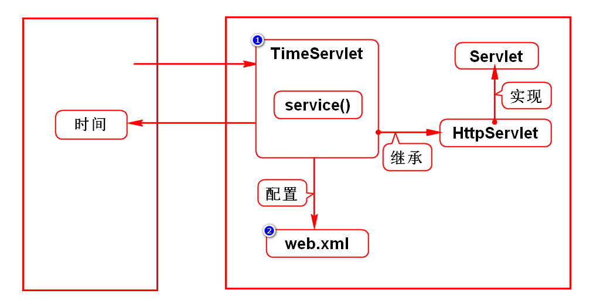
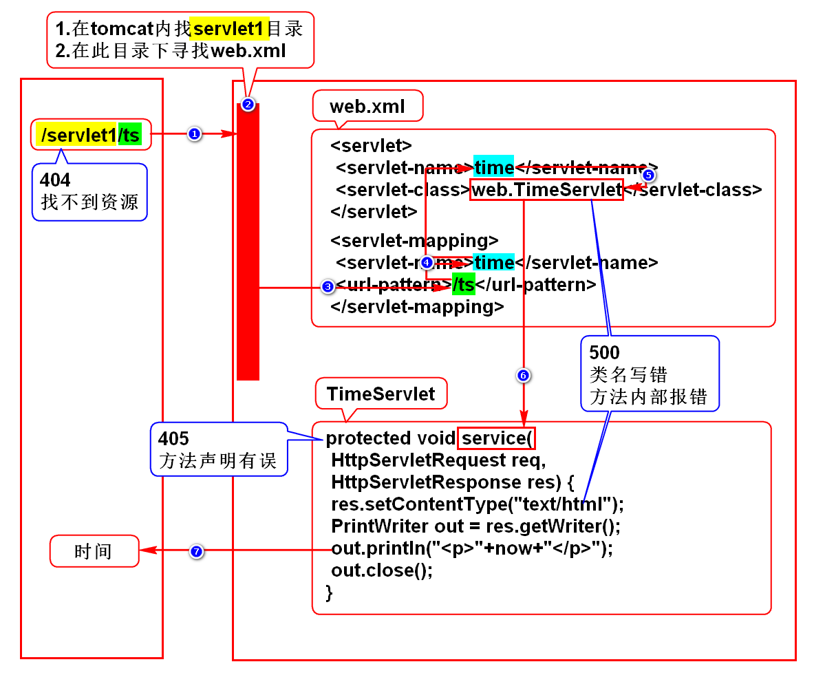

# 一.WEB应用的演变
## 1.演变的规律
- 由单机向网络演变
- 由CS向BS演变

## 2.CS和BS的区别
### 1)CS
- Client Server
- 客户端服务器程序
- 需要单独开发单独安装

### 2)BS
- Browser Server
- 浏览器服务器程序
- 用浏览器充当客户端,不需单独开发及安装

# 二.Servlet简介
## 1.服务器如何保存及返回一个网页?
### 1.1静态网页
- 无论谁去看结果都一样
- 新闻,百科
- 服务器保存HTML并返回这个HTML

### 1.2动态网页(*)
- 每个人看到的结果不一样
- 淘宝,微博
- 服务器保存一个对象,用它给用户动态拼HTML
> 在Java中这个对象就是Servlet

## 2.Servlet特征(*)
- 存储在服务器上
- 可以动态的拼资源(网页、图片等)
- 要满足sun的规范
> 动态拼资源术语:处理HTTP协议

## 3.什么是Servlet?
- 是sun推出的用于在服务器端处理HTTP协议的组件
> 组件:满足规范的对象

# 三.服务器
## 1.名词
- Java服务器
- Web服务器
- JavaWeb服务器
- Servlet容器

## 2.本质
- 是一个可以运行项目的软件
- 服务器和浏览器是对应的,是平级的

## 3.举例
- tomcat(Apache开源)
- JBOSS
- WebLogic
- WebSphere

# 四.tomcat
## 1.单独使用(上线时)
### 1)下载及安装
- 从Apache官网
- doc.tedu.cn/tomcat
- 解压缩即可
> 达内学生机上已经下载并安装好了

### 2)配置JAVA_HOME
- 达内学生机上已经配置好了

### 3)启动tomcat
- Linux:打开/tomcat/bin,终端输入chmod +x *sh
- Linux:打开/tomcat/bin,终端输入./startup.sh
- windows:打开/tomcat/bin,双击startup.bat

### 4)访问tomcat
- 浏览器输入http://localhost:8080
- 回车后看到一只猫就代表成功了

### 5)关闭tomcat
- Linux:打开/tomcat/bin,终端输入./shutdown.sh
- windows:打开/tomcat/bin,双击shutdown.bat

## 2.通过Eclipse调用tomcat(开发时)
- 看doc.tedu.cn/tomcat
- 任何原因导致需要重新配置的前提:
- 在Eclipse左侧选择Servers项目,删除它
- 点window->preference->Servers->runtime...
- 在窗口右侧选择tomcat,点击remove

# 五.Servlet开发步骤
## 1.创建WEB项目
- 必须具备标准的WEB目录:
- /webapp/WEB-INF/web.xml

## 2.导入jar包
### 1)maven
- 通过maven搜javaee
- 结果中选择javaee-api

### 2)使用tomcat自带的包
- 选择项目,鼠标右键,点击properties
- 弹出框中选择targeted runtimes
- 右侧勾选Apache tomcat
- Apply -> OK

## 3.编写Servlet
- 建包
- 创建类,继承于HttpServlet
- 重写父类的方法
> 实现Servlet接口是sun的规范

## 4.配置Servlet
- 声明Servlet类,取别名
- 通过别名引用Servlet,取网名

## 5.部署(拷贝)
- 在Servers下选择tomcat
- 右键点击Add and remove
- 弹出框中将被部署项目从左侧移动到右侧
- 启动tomcat
- 修改代码后要重新部署并启动tomcat
> 重新部署:选择tomcat,右键点击publish

# 六.程序执行过程及报错

