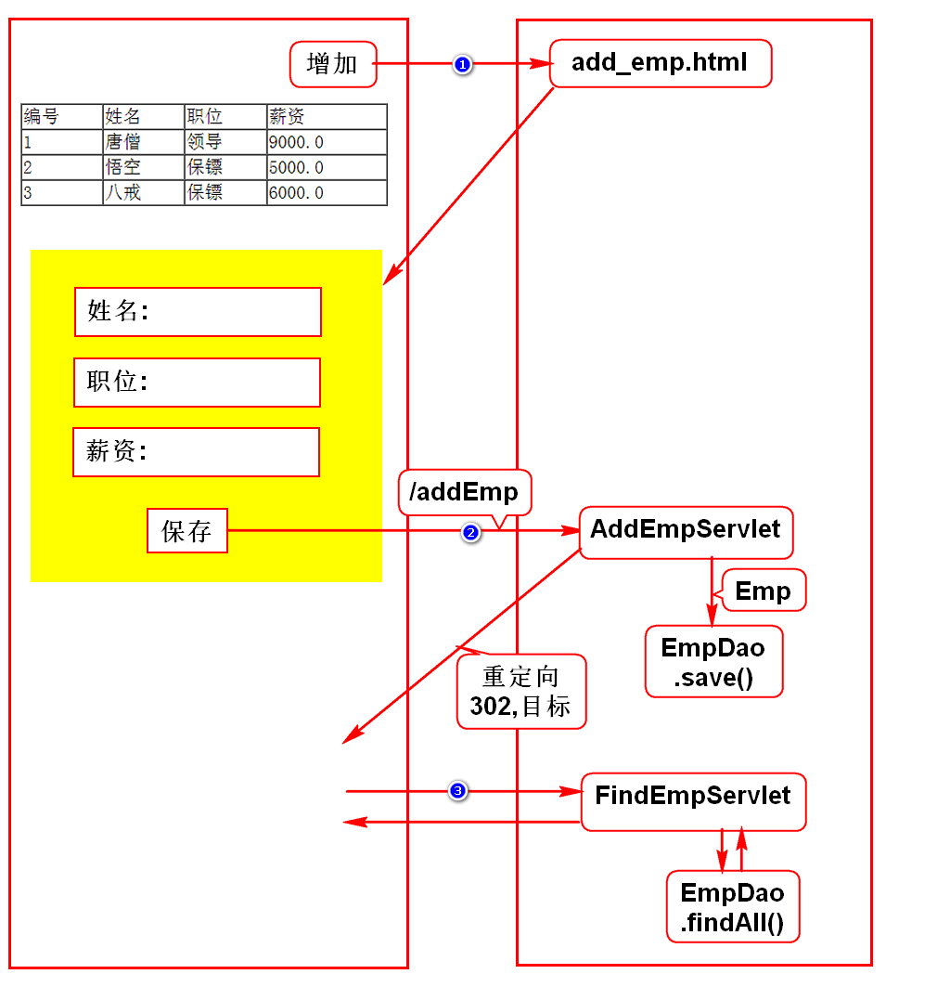
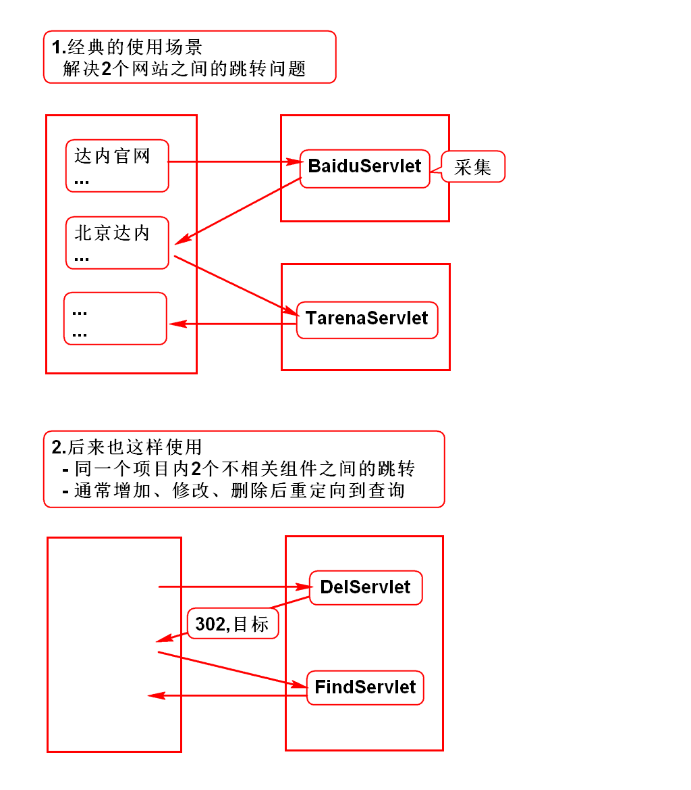
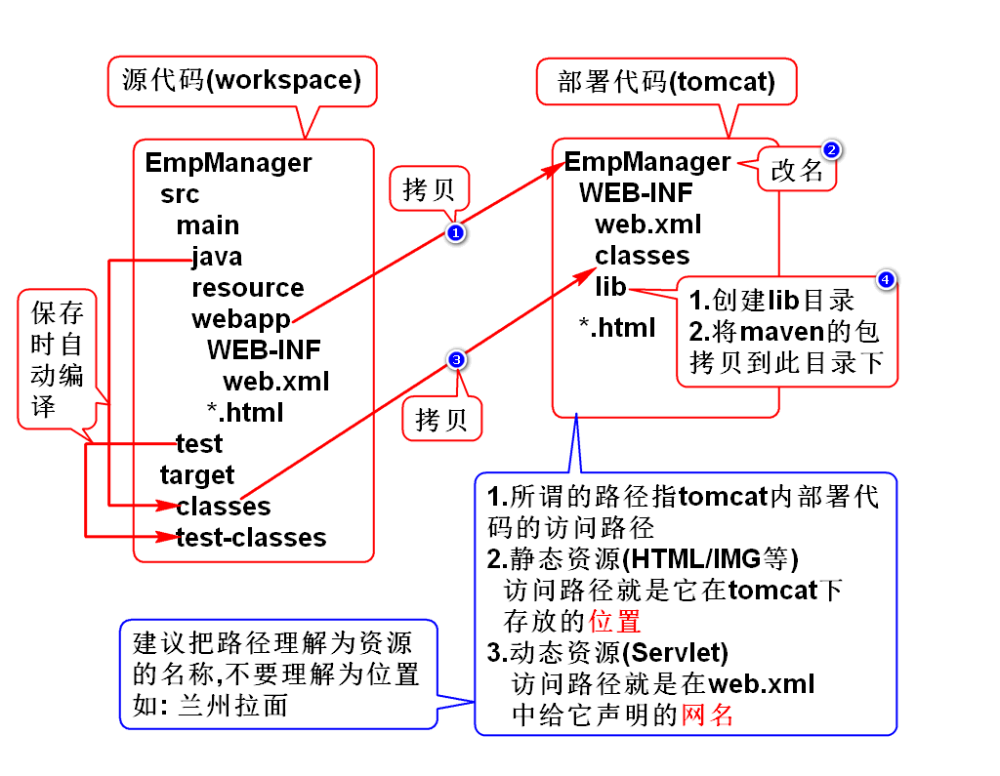
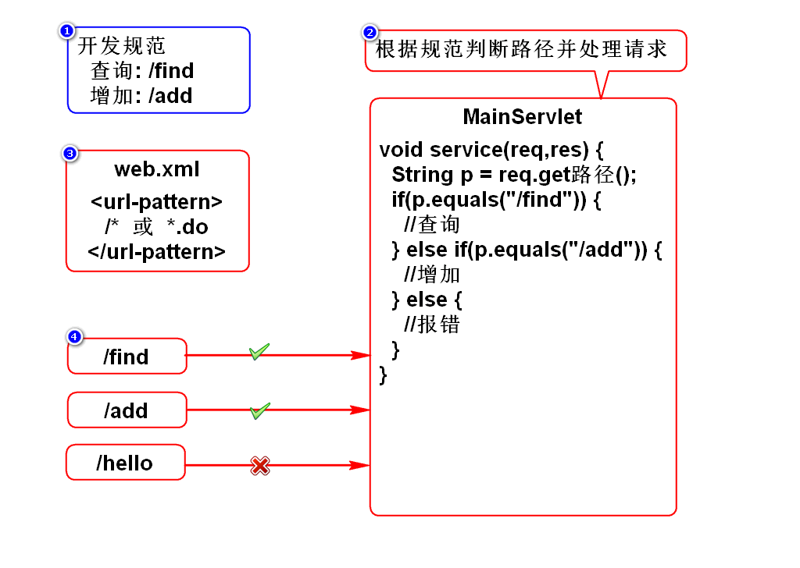
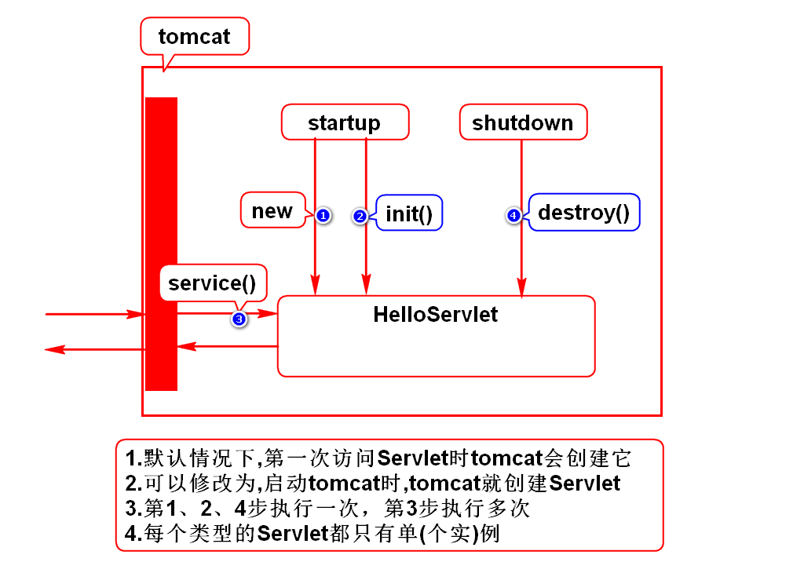

# 一.增加员工

# 二.重定向

# 三.访问路径

# 四.URI和URL的区别
## 1.表面上看
- URI是绝对路径
- URL是完整路径
- URL包含了URI

## 2.深入理解(*)
- 将URI理解为资源的名称(苍老师/二蛋/松/cang#null)
- 将URL理解为资源的真名(刘苍松)
- URI包含了URL

# 五.Servlet访问路径的配置方式
## 1.精确匹配(/hi)
- 只有/hi这一个名字可以访问此Servlet
- 此Servlet只能处理一个请求

## 2.通配符(/*)
- 所有的名字都可以访问此Servlet
- 此Servlet能处理一切请求

## 3.后缀(*.hi)
- 所有以hi为后缀的名字都可以访问此Servlet
- 此Servlet能处理很多请求

# 六.使用一个Servlet处理多个请求的方式

# 七.Servlet生命周期

# 补充
## 1.JavaBean
- 满足如下规范的类
- 有package
- 有默认构造器
- 实现序列化接口
- 通常有get/set方法
> 建议初学者将所有的类都满足规范