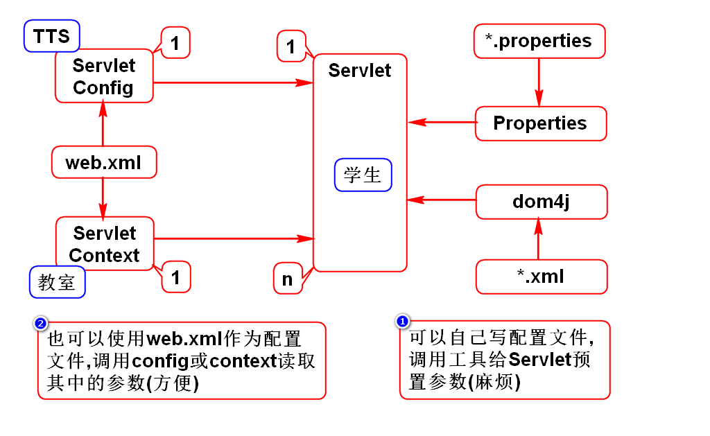
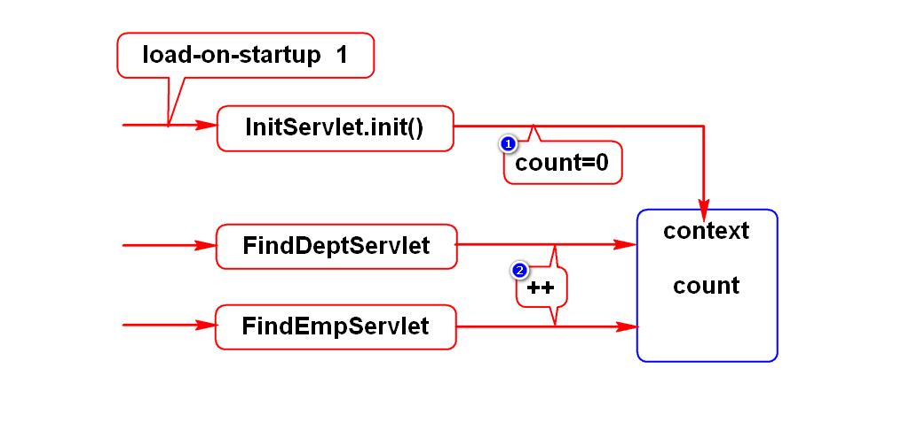
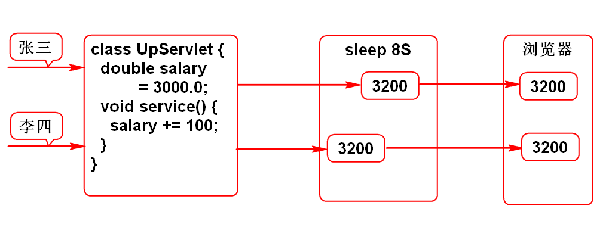
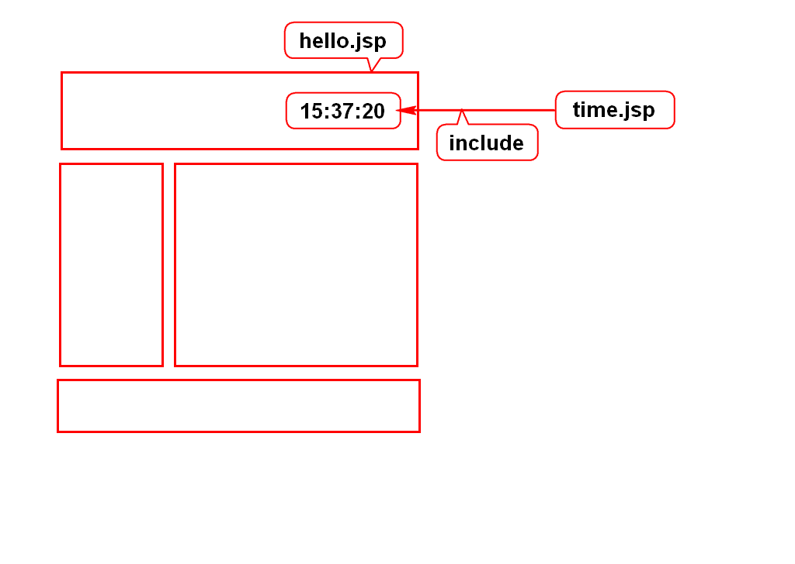
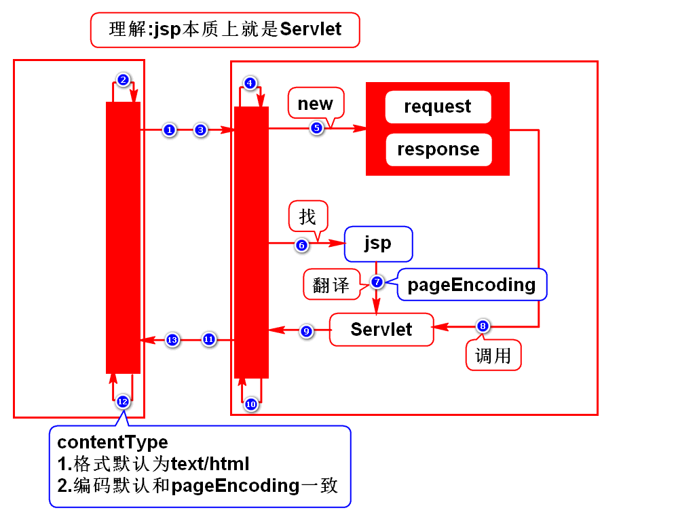
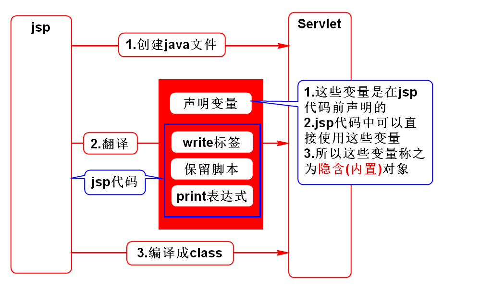

# 一.config和context
## 1.它们的对比
- 共同点:都能读取web.xml中的参数
- config和Servlet是1对1的关系
- context和Servlet是1对多的关系
> 它们都是为Servlet服务的

## 2.config
- 假设开发一个网页游戏,当在线人数超出限制时要排队.
- 最大在线人数maxOnline可配置
- 只在登录(LoginServlet)时验证是否超出限制
> 想要给某一个Servlet预置参数用config

## 3.context
- 软件都有各种查询功能,一般都支持分页
- 分页需要已知:当前页,每页显示多少条size
- 其中size一般可配置
- 多个查询功能都要使用size,使用context预置
> 想要给多个Servlet预置参数用context

## 4.context特殊的用途
- 提示:之前使用config和context读取的都是常量
- context还可以读写变量
- 案例:统计项目流量

# 二.Servlet线程安全问题
## 1.什么时候有线程安全问题
### 局部变量
- 局部变量存储于栈内
- 每个线程有自己的栈帧
> 同时修改局部变量没问题

### 成员变量
- 成员变量存储在堆内
- 多个线程共享堆中数据
> 同时修改成员变量有问题

## 2.如何解决问题
- 加锁

# 三.include

# 四.jsp原理

# 五.翻译过程

# 六.jsp隐含(内置)对象(面试题)
## 1.request(*)
- HttpServletRequest

## 2.response
- HttpServletResponse

## 3.out
- JSPWriter
- 和PrintWriter一样

## 4.config
- ServletConfig

## 5.application
- ServletContext

## 6.exception
- Throwable

## 7.session(*)
- 将来再讲

## 8.page
- 类型为Object
- 就是this,指代翻译生成的那个Servlet

## 9.pageContext
- PageContext
- 是一个管理者,通过它可以获取其他8个对象

## 如何使用?
- <%=request.getParameter("user")%>
- <%String user = request.getParameter("user");%>

