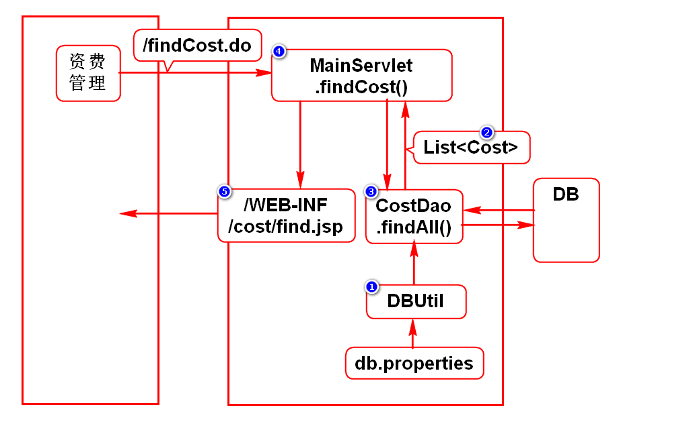
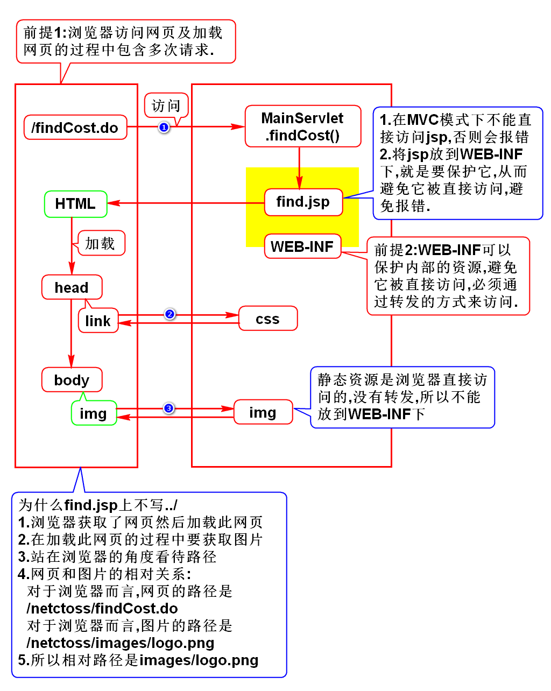

# 一.项目介绍
## 1.NETCTOSS
- C:China
- T:Telecom 电信
- O:Operation 运营
- S:Support 支持
- S:System 系统
- 中国电信运营支持系统-网络版

## 2.导入jar包
- javaee:使用tomcat内置的jar包
- jstl:使用maven搜jstl,选择1.2
- jdbc:使用maven搜ojdbc,选择10.2.0.4.0
- dbcp:使用maven搜commons-dbcp,选择1.4

## 3.开发思路(***)
1. 根据操作分析本功能包含几个请求
2. 分析每个请求的执行过程
3. 每个请求按照倒序开发

# 二.资费查询

# 三.WEB-INF的作用

